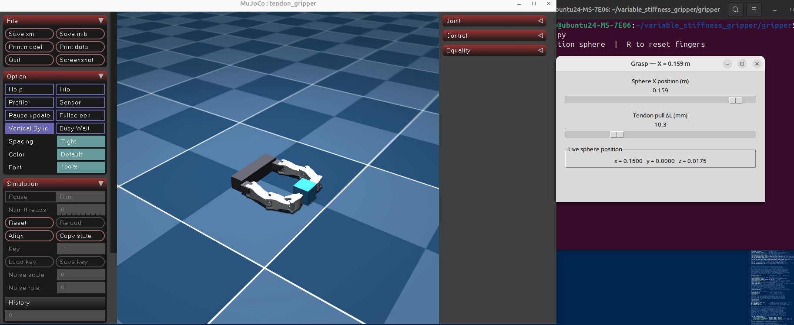
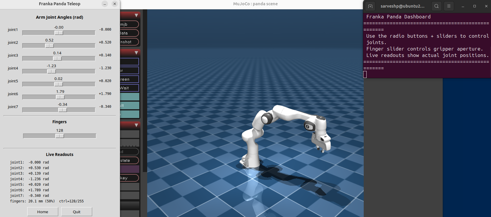

# variable_stiffness_gripper

MuJoCo simulation suite for a **tendon-driven underactuated 2-finger gripper** with variable stiffness, integrated with a Franka Emika Panda arm.

## Project Structure

```
├── gripper/                  # Core tendon-driven gripper simulation
│   ├── config.py             # Single source of truth: geometry, stiffness, contacts, etc.
│   ├── build_gripper.py      # Generates gripper MuJoCo XML from config
│   ├── dashboard_grasp.py    # Tkinter dashboard with sliders for object position & ΔL
│   └── view_gripper.py       # Quick interactive viewer (arrow keys for tendon pull)
│
├── franka_gripper/           # Franka Panda arm standalone
│   ├── dashboard.py          # Tkinter panel for joint-angle control of the arm
│   ├── teleop_franka.py      # Keyboard teleop for the arm
│   ├── pick_place.py         # Pick-and-place demo
│   └── build_franka.py       # Builds the Franka MuJoCo model
│
├── franka_tendon_ee/         # Franka arm + tendon-driven gripper end-effector
│   ├── build.py              # Builds the combined Franka+gripper model
│   ├── teleop.py             # Keyboard teleop with gripper control
│   └── pick_place_tendon.py  # Pick-and-place using the tendon gripper
│
├── image_assets/             # Screenshots
│   ├── gripper.png
│   └── franka_dashboard.png
│
├── video_assets/             # Demonstration videos
│   ├── TENDON_GRIPPER_PICK_PLACE.mp4
│   └── FRANKA_PICK_PLACE.mp4
│
└── literature_review/        # Related-work PDFs and notes
```

## Getting Started

Activate the MuJoCo environment:

```bash
source ~/underactuated-hand-sim/mujoco_env/bin/activate
```

### Gripper dashboard (interactive grasping)

```bash
python gripper/dashboard_grasp.py
```

Sliders control object X-position and tendon pull ΔL (mm). Press **R** to reset fingers.

### Gripper quick viewer

```bash
python gripper/view_gripper.py
```

Up/Down arrows adjust tendon pull.

### Franka arm dashboard

```bash
python franka_gripper/dashboard.py
```

### Franka + tendon gripper pick-and-place

```bash
python franka_tendon_ee/pick_place_tendon.py
```

## Media

| Preview | File | Description |
|---------|------|-------------|
|  | `image_assets/gripper.png` | Tendon gripper grasping a cube |
|  | `image_assets/franka_dashboard.png` | Franka dashboard UI |

### Videos

<video src="video_assets/TENDON_GRIPPER_PICK_PLACE.mp4" controls width="600"></video>
<br>
<video src="video_assets/FRANKA_PICK_PLACE.mp4" controls width="600"></video>

## Literature Review

The `literature_review/` folder contains PDFs and markdown summaries on variable-stiffness grippers, underactuated hands, soft robotics, and related work (ADAPT, ORCA, CRAFT, DexHand, etc.).
